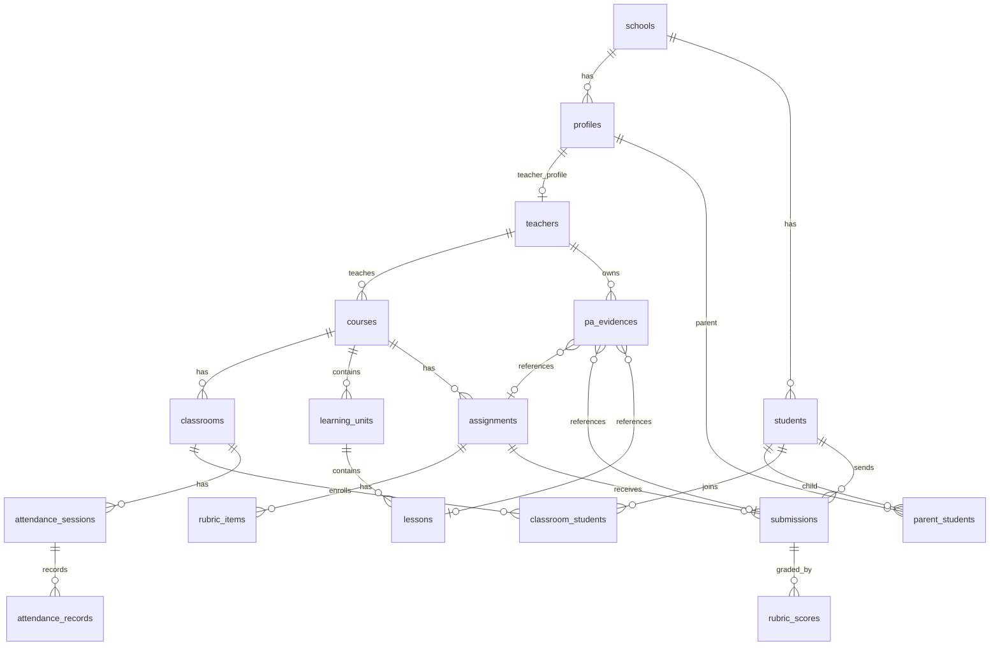

# Database Design

เอกสารนี้เป็นฐานข้อมูลรุ่น MVP สำหรับต่อยอดจาก prototype ไปสู่ระบบจริงด้วย Supabase/PostgreSQL

## ขอบเขต MVP

รุ่นแรกควรรองรับ flow ที่ prototype มีอยู่แล้ว:

- Login และแยกบทบาทครู นักเรียน ผู้ปกครอง
- ห้องเรียนและรายวิชา
- หน่วยการเรียนรู้และบทเรียน
- งาน ใบงาน rubric การส่งงาน และการตรวจงาน
- การเช็กชื่อ
- ไฟล์แนบ
- หลักฐาน ว PA ที่เชื่อมกับบทเรียน งาน ผลงานนักเรียน และผลลัพธ์ผู้เรียน
- ประกาศพื้นฐาน

## กลุ่มตารางหลัก

| กลุ่ม | ตาราง | ใช้กับหน้าจอ |
| --- | --- | --- |
| ผู้ใช้ | `profiles`, `teachers`, `students`, `parent_students` | Login, เลือกบทบาท, มุมมองผู้ปกครอง |
| ห้องเรียน | `schools`, `courses`, `classrooms`, `classroom_students` | Dashboard, ห้องเรียน, รายละเอียดห้องเรียน |
| การสอน | `learning_units`, `lessons` | รายละเอียดหน่วย, แผนการสอน, ว PA |
| งานและคะแนน | `assignments`, `rubric_items`, `submissions`, `rubric_scores` | งาน, รายละเอียดงาน, ตรวจงาน |
| เข้าเรียน | `attendance_sessions`, `attendance_records` | เช็กชื่อ, แจ้งผู้ปกครอง |
| ไฟล์ | `files`, `submission_files` | ส่งงาน, แนบไฟล์, storage |
| ว PA | `pa_evidences`, `pa_evidence_files` | Portfolio, เพิ่มหลักฐาน, รายงาน |
| สื่อสาร | `announcements` | ประกาศถึงนักเรียน/ผู้ปกครอง |

## ความสัมพันธ์สำคัญ



## Mapping กับ Prototype

| Prototype screen | ข้อมูลหลักที่ต้อง query |
| --- | --- |
| Login | `profiles` และ Supabase Auth |
| เลือกบทบาท | `profiles.role` |
| Dashboard ครู | `courses`, `classrooms`, `assignments`, `submissions`, `attendance_records`, `pa_evidences` |
| ห้องเรียน | `courses`, `learning_units`, `classroom_students`, `students` |
| รายละเอียดงาน | `assignments`, `rubric_items`, `submissions` |
| ตรวจงาน | `submissions`, `rubric_scores`, `files`, `pa_evidences` |
| เช็กชื่อ | `attendance_sessions`, `attendance_records` |
| เพิ่มหลักฐาน ว PA | `pa_evidences`, `pa_evidence_files`, `files` |
| Preview รายงาน ว PA | `pa_evidences`, `assignments`, `submissions`, `attendance_records` |

## Query ที่ต้องมีในรุ่นแรก

1. Dashboard ครู

```sql
select
  c.id,
  c.title,
  c.grade_level,
  c.semester,
  c.academic_year,
  count(distinct cs.student_id) as student_count,
  count(distinct s.id) filter (where s.status = 'submitted') as submitted_count,
  count(distinct pe.id) as evidence_count
from courses c
left join classrooms cr on cr.course_id = c.id
left join classroom_students cs on cs.classroom_id = cr.id
left join assignments a on a.course_id = c.id
left join submissions s on s.assignment_id = a.id
left join pa_evidences pe on pe.course_id = c.id
where c.teacher_id = :teacher_id
group by c.id;
```

2. งานที่รอตรวจ

```sql
select
  s.id,
  a.title,
  st.first_name,
  st.last_name,
  s.submitted_at,
  s.status
from submissions s
join assignments a on a.id = s.assignment_id
join students st on st.id = s.student_id
where a.created_by = :teacher_id
  and s.status = 'submitted'
order by s.submitted_at asc;
```

3. หลักฐาน ว PA รายปี

```sql
select
  category,
  count(*) as evidence_count
from pa_evidences
where teacher_id = :teacher_id
  and academic_year = :academic_year
group by category;
```

## แนวทาง Supabase Storage

ใช้ bucket แยกตามประเภทเพื่อกำหนดสิทธิ์ง่าย:

| Bucket | ใช้เก็บ |
| --- | --- |
| `lesson-materials` | แผนการสอน ใบงาน สื่อประกอบ |
| `submissions` | ไฟล์งานนักเรียน |
| `pa-evidences` | ไฟล์หลักฐาน ว PA |
| `reports` | PDF รายงานที่ export |

Path แนะนำ:

```text
schools/{school_id}/courses/{course_id}/assignments/{assignment_id}/submissions/{student_id}/{file_name}
schools/{school_id}/pa/{teacher_id}/{academic_year}/{category}/{file_name}
schools/{school_id}/reports/{teacher_id}/{academic_year}/{file_name}
```

## ขั้นตอนหลังจากนี้

1. สร้าง Supabase project
2. รัน `database/schema.sql`
3. รัน `database/policies.sql` เพื่อเปิด Row Level Security ตั้งต้น
4. รัน `database/seed.sql` เพื่อใส่ข้อมูลตัวอย่าง
5. สร้าง bucket ตามรายการด้านบน
6. ย้าย prototype เป็น Next.js
7. เชื่อมหน้า Login, Dashboard, งาน, ตรวจงาน และ ว PA กับ Supabase ทีละหน้า
